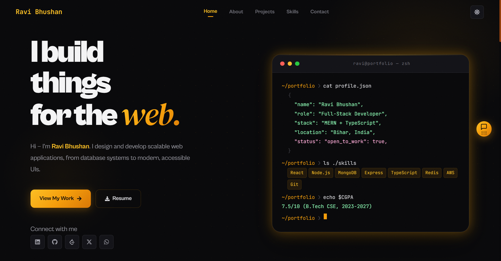
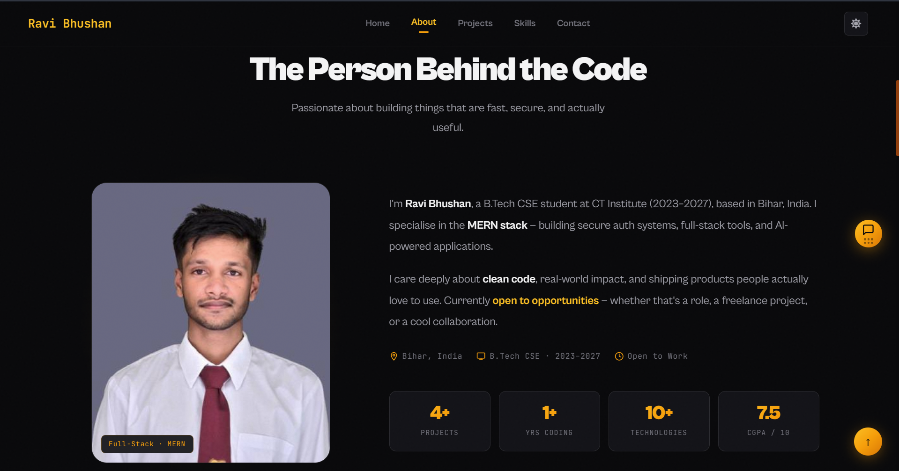
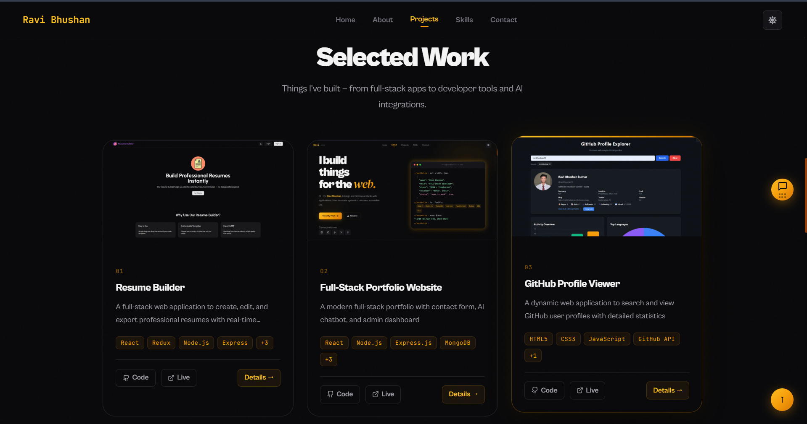
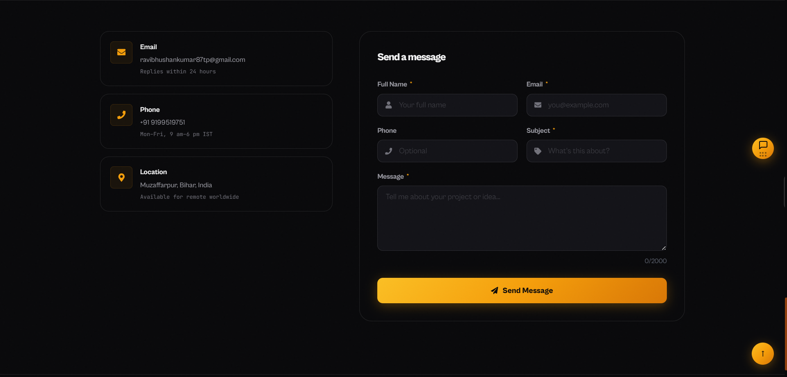
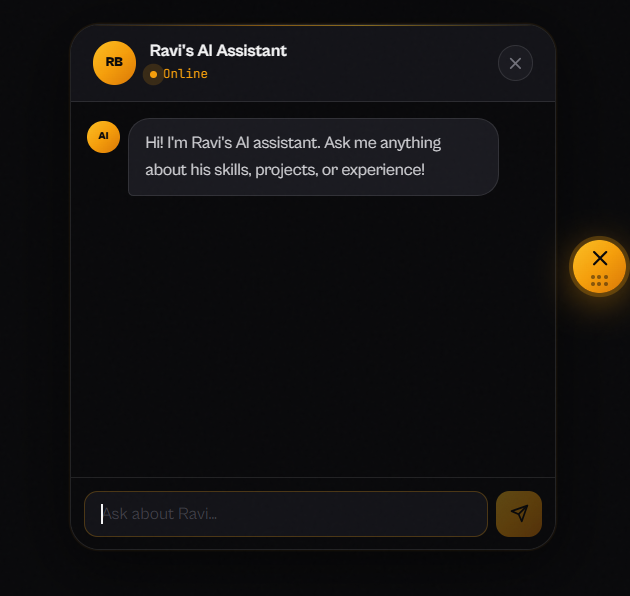
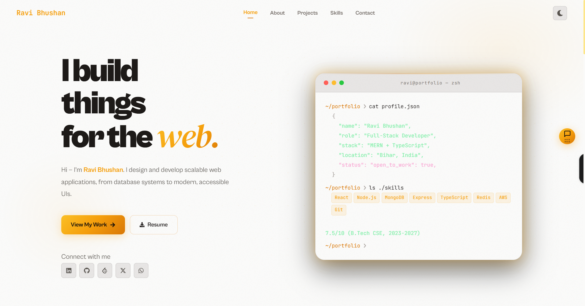

# Ravi Bhushan — Full-Stack Portfolio Website

A modern, full-stack portfolio website with an **AI-powered chatbot**, working contact form, and interactive UI. Built with React, Vite, and Node.js — featuring smooth animations, dark/light theme, and a terminal-style hero section.

---

## 📸 Screenshots

<table align="center">
  <tr>
    <td align="center">
      <br/>
      <em>Home Page</em>
    </td>
    <td align="center">
      <br/>
      <em>About </em>
    </td>
  </tr>
  <tr>
    <td align="center">
        <br/>
      <em>Projects Section</em>
    </td>
    <td align="center">
      <br/>
      <em>Contact section </em>
    </td>
  </tr>
   <tr>
    <td align="center">
      <br/>
      <em>AI chatbot</em>
    </td>
     <td align="center">
      <br/>
      <em>Light theme </em>
    </td>
     </tr>
</table>

---

## 🌐 [Live Demo](https://ravibhushan-portfolio.vercel.app)


## 🌟 Features

### 🤖 AI Chatbot (About Section)
- Embedded AI assistant powered by **Groq's LLaMA 3.3 70B** model
- Answers visitor questions about skills, projects, education, and experience
- Full conversation history maintained per session
- Animated typing indicator and smooth auto-scroll

### 💼 Projects Showcase
- Interactive project cards with hover animations
- Image carousel modal with keyboard navigation (`Esc` to close)
- Features, tech stack, live demo & GitHub links per project
- "Load more" pagination

### 🎨 Hero Terminal
- Animated terminal card with realistic typewriter effect
- Displays profile JSON and skill tags dynamically
- Multi-stage rendering with per-character timing

### 📬 Contact Form
- Full-stack contact form with **MongoDB** storage
- Client-side and server-side validation
- Success/error toast notifications
- Phone, email, and location info cards

### 🌗 UI/UX
- Dark and light theme toggle with system-level CSS variables
- Fully responsive — mobile, tablet, desktop
- Collapsible navbar with active-section highlighting
- Scroll-to-top button
- Noise grain overlay for texture
- Smooth section animations (fade-up, slide-in)

---

## 🛠️ Technologies Used

### Frontend (Client)

| Technology           | Purpose                        | Version  |
|----------------------|--------------------------------|----------|
| React                | UI Framework                   | 18+      |
| Vite                 | Build Tool                     | 5+       |
| Groq API (LLaMA 3.3) | AI Chatbot Inference           | Latest   |
| React Icons          | Icon Library                   | 5+       |
| Lucide React         | Additional Icons               | 0.383.0  |
| React Type Animation | Typing Effect (Hero)           | 3+       |
| CSS Variables        | Design Token System            | —        |

### Backend (Server)

| Technology    | Purpose                         | Version |
|---------------|---------------------------------|---------|
| Node.js       | Runtime Environment             | 18+     |
| Express.js    | Web Framework                   | 4+      |
| MongoDB       | Database (Contact Form)         | Latest  |
| Mongoose      | ODM                             | 8+      |
| dotenv        | Environment Variables           | 16+     |
| cors          | Cross-Origin Resource Sharing   | 2+      |

### DevOps & Tools

| Tool      | Purpose               |
|-----------|-----------------------|
| Vercel    | Frontend Deployment   |
| Railway   | Backend Deployment    |
| Nodemon   | Dev Server Auto-reload|
| Git       | Version Control       |

---

## 🚀 Getting Started

### Prerequisites

- Node.js `>= 18.0.0`
- npm `>= 8.0.0`
- MongoDB URI (Atlas or local)
- Groq API key ([get one free at console.groq.com](https://console.groq.com))

### Installation Steps

1. **Clone the repository**
   ```bash
   git clone https://github.com/ravibhushan10/Portfolio-Full-Stack.git
   cd Portfolio-Full-Stack
   ```

2. **Install Client Dependencies**
   ```bash
   cd client
   npm install
   ```

3. **Install Server Dependencies**
   ```bash
   cd ../server
   npm install
   ```

4. **Client Environment Variables — create `.env` in `client/`**
   ```env
   VITE_API_URL=http://localhost:5000/api
   VITE_APP_GROQ_API_KEY=your_groq_api_key_here
   ```

5. **Server Environment Variables — create `.env` in `server/`**
   ```env
   PORT=5000
   NODE_ENV=development
   CLIENT_URL=http://localhost:5173
   MONGO_URI=your_mongodb_connection_string
   ```

6. **Start the Server**
   ```bash
   cd server
   npm run dev
   # Server runs on http://localhost:5000
   ```

7. **Start the Client** (in a new terminal)
   ```bash
   cd client
   npm run dev
   # Client runs on http://localhost:5173
   ```

---

## 📖 Usage Guide

### Navigating the Portfolio

- **Home** — Animated terminal with profile JSON and tech stack tags
- **About** — Bio, stats (projects, CGPA, technologies), and AI chatbot
- **Projects** — Card grid with modal detail view and image carousel
- **Skills** — Categorised skill list (Languages, Frontend, Backend, Infrastructure)
- **Contact** — Contact info + message form backed by MongoDB

### Using the AI Chatbot

1. Navigate to the **About** section
2. Type any question about Ravi's skills, projects, or background
3. The AI responds using portfolio context — no general web knowledge
4. Example questions:
   - *"What projects has Ravi built?"*
   - *"What is his tech stack?"*
   - *"Is he open to work?"*

### Sending a Contact Message

1. Navigate to the **Contact** section
2. Fill in Full Name, Email, Subject, and Message (required)
3. Phone is optional
4. Click **Send Message** — stored in MongoDB and displays a toast confirmation

---

## 📁 Project Structure

```
Portfolio-Full-Stack/
├── client/
│   ├── data/
│   │   ├── Realdata/
│   │   │   ├── aiData.js          # AI system prompt & portfolio data
│   │   │   └── projectData.js     # Projects config & image imports
│   │   └── screenshots/           # Project screenshot assets
│   ├── public/
│   │   └── tab_icon.svg
│   └── src/
│       ├── components/
│       │   ├── Navbar/Navbar.jsx
│       │   ├── Hero/Hero.jsx
│       │   ├── About/About.jsx    # AI chatbot lives here
│       │   ├── Projects/Projects.jsx
│       │   ├── Skills/Skills.jsx
│       │   └── Contact/Contact.jsx
│       ├── App.jsx
│       ├── main.jsx
│       └── index.css              # Full design token system
│
└── server/
    ├── config/db.js               # MongoDB connection
    ├── controllers/
    │   └── contactController.js
    ├── models/
    │   └── contact.js             # Mongoose schema
    ├── routes/
    │   └── contact.js
    └── server.js                  # Express app entry point
```

---

## 🔌 API Endpoints

| Method | Endpoint         | Description              |
|--------|------------------|--------------------------|
| GET    | `/api/health`    | Server health check      |
| POST   | `/api/contact`   | Submit a contact message |
| GET    | `/api/contacts`  | List all messages (admin)|


---

## 🤝 Contributing

### How to Contribute

1. **Fork the Repository**
   - Click the **Fork** button at the top right of this repository

2. **Clone Your Fork**
   ```bash
   git clone https://github.com/your-username/Portfolio-Full-Stack.git
   cd Portfolio-Full-Stack
   ```

3. **Create a Branch**
   ```bash
   git checkout -b feature/AmazingFeature
   ```

4. **Make Your Changes**
   - Write clean, readable code
   - Follow the existing code style
   - Test your changes thoroughly

5. **Commit Your Changes**
   ```bash
   git add .
   git commit -m 'Add some AmazingFeature'
   ```

6. **Push to Your Fork**
   ```bash
   git push origin feature/AmazingFeature
   ```

7. **Open a Pull Request**
   - Go to your forked repository on GitHub
   - Click **"Compare & pull request"**
   - Fill in the PR form:
     - **Title**: Brief summary (e.g., "Add dark mode animation")
     - **Description**: What changed, why, screenshots if UI change
     - **Related issues**: e.g., "Fixes #12"
   - Click **"Create pull request"**

---

## 🔮 Planned Improvements

- [ ] Admin dashboard to view contact form submissions
- [ ] Enhanced AI chatbot with contextual memory across sessions
- [ ] Dark mode transitions with animated theme toggle
- [ ] Performance optimisation and Lighthouse score improvements
- [ ] SEO meta tags and Open Graph support
- [ ] Multi-language (i18n) support
- [ ] Blog / articles section

---

## 👨‍💻 Author

**Ravi Bhushan**

- 💼 LinkedIn: [https://www.linkedin.com/in/ravibhushan-kumar-55b312344](https://www.linkedin.com/in/ravibhushan-kumar-55b312344/)
-  🌐 Portfolio: [https://ravibhushan-portfolio.vercel.app](https://ravibhushan-portfolio.vercel.app)
- 🐙 GitHub: [@ravibhushan10](https://github.com/ravibhushan10)
- 📧 Email: ravibhushankumar87tp@gmail.com


---

<div align="center">

### ⭐ Star this repository if it helped you!

**Made with ❤️ by Ravi Bhushan**

[Live Demo](https://ravibhushan-portfolio.vercel.app) · [Report Bug](https://github.com/ravibhushan10/Portfolio-Full-Stack/issues) · [Request Feature](https://github.com/ravibhushan10/Portfolio-Full-Stack/issues)

</div>
